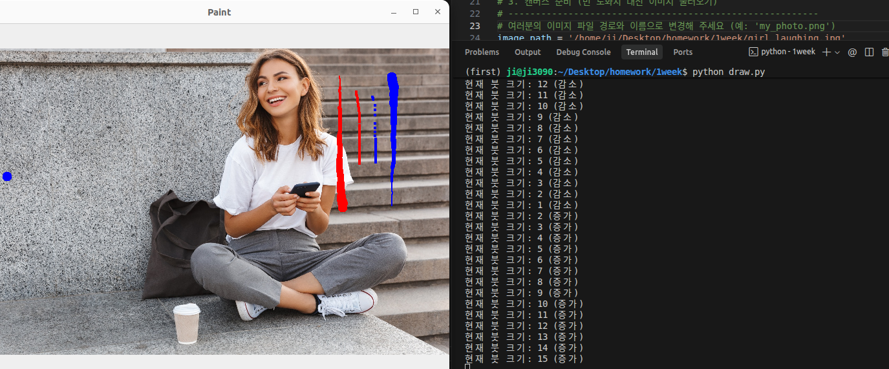
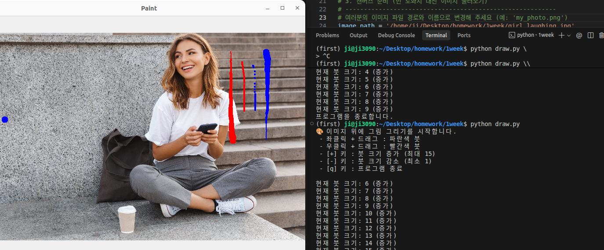

## 프로젝트 개요
OpenCV를 사용하여 원본 이미지를 도화지 삼아, 마우스 좌/우클릭 드래그를 통해 파란색과 빨간색 선을 자유롭게 그리고 키보드로 붓의 굵기를 실시간으로 조절하는 대화형(Interactive) 그림판 프로그램입니다.


##  주요 코드 해석 (Key Code Analysis)

### 1. 클릭과 드래그 동시 감지 (비트 연산자 활용)
```python
if event == cv.EVENT_LBUTTONDOWN or (event == cv.EVENT_MOUSEMOVE and (flags & cv.EVENT_FLAG_LBUTTON)):
    cv.circle(img, (x, y), brush_size, (255, 0, 0), -1)
```
* **설명:** 마우스를 단순히 이동할 때(`EVENT_MOUSEMOVE`)뿐만 아니라, **좌클릭 버튼이 눌린 상태로 이동 중인지** 확인하기 위해 `flags & cv.EVENT_FLAG_LBUTTON` 비트 연산을 수행했습니다. 이를 통해 끊김 없는 부드러운 곡선을 그릴 수 있습니다. 우클릭(빨간색 붓)에도 동일한 원리가 적용되었습니다.

### 2. 우클릭 컨텍스트 메뉴 방지 (`WINDOW_GUI_NORMAL`)
```python
cv.namedWindow('Paint', cv.WINDOW_GUI_NORMAL)
```
* **설명:** OpenCV의 기본 윈도우 창에서는 우클릭 시 옵션 메뉴가 팝업되어 드로잉을 방해하는 문제가 있습니다. 이를 해결하기 위해 `cv.WINDOW_GUI_NORMAL` 플래그를 사용하여 창을 생성함으로써 방해 요소 없이 온전히 그림 그리기에 집중할 수 있는 환경을 구축했습니다.

### 3. 키보드를 통한 동적 상태 제어 (`brush_size`)
```python
elif key == ord('+') or key == ord('='):
    if brush_size < 15:  
        brush_size += 1
```
* **설명:** `while` 루프 내에서 사용자의 키보드 입력 값을 실시간으로 받아 전역 변수인 `brush_size`를 업데이트합니다. 최댓값(15)과 최솟값(1)의 리미트를 설정하여 안정성을 확보했습니다.

##  조작 가이드
* `마우스 좌클릭 + 드래그` : 파란색 붓으로 그리기
* `마우스 우클릭 + 드래그` : 빨간색 붓으로 그리기
* `+` / `-` : 붓 크기 키우기 / 줄이기 (1~15)
* `q` : 프로그램 종료

##  실행 결과 화면




## 전체 코드
```python
import cv2 as cv
import numpy as np
import sys

# 1. 초기 붓 크기 설정
brush_size = 5

# 2. 마우스 이벤트 처리 콜백 함수
def draw_brush(event, x, y, flags, param):
    global brush_size
    
    # [좌클릭 및 드래그 처리 - 파란색 붓]
    if event == cv.EVENT_LBUTTONDOWN or (event == cv.EVENT_MOUSEMOVE and (flags & cv.EVENT_FLAG_LBUTTON)):
        cv.circle(img, (x, y), brush_size, (255, 0, 0), -1)
        
    # [우클릭 및 드래그 처리 - 빨간색 붓]
    elif event == cv.EVENT_RBUTTONDOWN or (event == cv.EVENT_MOUSEMOVE and (flags & cv.EVENT_FLAG_RBUTTON)):
        cv.circle(img, (x, y), brush_size, (0, 0, 255), -1)

# ---------------------------------------------------------
# 3. 캔버스 준비 (빈 도화지 대신 이미지 불러오기)
# ---------------------------------------------------------
# 여러분의 이미지 파일 경로와 이름으로 변경해 주세요 (예: 'my_photo.png')
image_path = '/home/ji/Desktop/homework/1week/girl_laughing.jpg'
img = cv.imread(image_path)

# 이미지를 제대로 불러왔는지 확인 (파일이 없으면 프로그램 종료)
if img is None:
    print(f" '{image_path}' 이미지를 불러올 수 없습니다. 파일 이름과 위치를 확인해 주세요!")
    sys.exit()

# 4. 윈도우 창 설정 (우클릭 메뉴 방지를 위해 WINDOW_GUI_NORMAL 사용)
cv.namedWindow('Paint', cv.WINDOW_GUI_NORMAL)
cv.setMouseCallback('Paint', draw_brush)

print(" 이미지 위에 그림 그리기를 시작합니다.")
print(" - 좌클릭 + 드래그 : 파란색 붓")
print(" - 우클릭 + 드래그 : 빨간색 붓")
print(" - [+] 키 : 붓 크기 증가 (최대 15)")
print(" - [-] 키 : 붓 크기 감소 (최소 1)")
print(" - [q] 키 : 프로그램 종료\n")

# 5. 메인 무한 루프
while True:
    cv.imshow('Paint', img)
    
    key = cv.waitKey(1) & 0xFF
    
    # [종료]
    if key == ord('q'):  
        print("프로그램을 종료합니다.")
        break            
        
    # [붓 크기 증가] + 또는 = 키
    elif key == ord('+') or key == ord('='):
        if brush_size < 15:  
            brush_size += 1
            print(f"현재 붓 크기: {brush_size} (증가)")
            
    # [붓 크기 감소] - 키
    elif key == ord('-'):  
        if brush_size > 1:   
            brush_size -= 1
            print(f"현재 붓 크기: {brush_size} (감소)")

cv.destroyAllWindows()

```