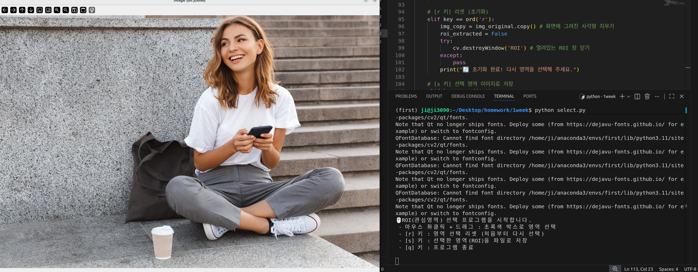
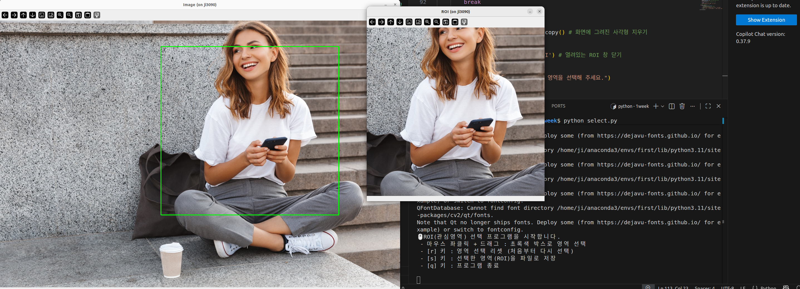

# [과제 3] 마우스 이벤트를 활용한 관심영역(ROI) 추출 및 저장

## 프로젝트 개요
OpenCV를 이용하여 원본 이미지를 불러오고, 사용자가 마우스 드래그를 통해 직접 원하는 관심영역(ROI, Region of Interest)을 선택하여 독립된 창으로 분리하고 파일로 저장하는 프로그램입니다.


## 주요 코드 해석 (Key Code Analysis)

### 1. 드래그 잔상(Trail) 방지를 위한 얕은 복사 (`copy()`)
```python
elif event == cv.EVENT_MOUSEMOVE:
    if drawing:
        fx, fy = x, y
        # 원본 훼손 및 드래그 잔상을 막기 위해 매 프레임 copy() 사용
        img_copy = img_original.copy() 
        cv.rectangle(img_copy, (ix, iy), (fx, fy), (0, 255, 0), 2)
```
* **설명:** 마우스를 움직일 때마다 사각형이 계속 겹쳐서 그려지는(잔상) 문제를 해결하기 위해, 캔버스를 갱신할 때마다 깨끗한 원본 이미지(`img_original.copy()`)를 불러온 뒤 그 위에 현재 좌표까지의 사각형을 덮어 그리는 방식을 사용했습니다.

### 2. 예외 처리 및 Numpy 슬라이싱을 통한 ROI 추출
```python
x1, x2 = min(ix, fx), max(ix, fx)
y1, y2 = min(iy, fy), max(iy, fy)

if x2 > x1 and y2 > y1:
    # 세로(y)부터 가로(x) 순서로 자르기
    roi = img_original[y1:y2, x1:x2] 
    cv.imshow('ROI', roi)
```
* **설명:** 사용자가 드래그를 우측 하단이 아닌 좌측 상단 등 역방향으로 했을 때 좌표 역전으로 인한 에러가 발생하지 않도록 `min()`, `max()` 함수로 좌표를 정렬했습니다. 이후 OpenCV 이미지 배열의 특성에 맞게 Numpy 슬라이싱(`[y범위, x범위]`)을 적용하여 이미지를 정확히 오려냈습니다.

### 3. 상태 제어 및 이미지 저장 (`cv.imwrite`)
```python
elif key == ord('s'): 
    if roi_extracted and roi is not None:
        cv.imwrite('saved_roi.jpg', roi) 
```
* **설명:** 잘라낸 이미지가 존재하는지 플래그(`roi_extracted`)로 먼저 검증한 뒤, `cv.imwrite` 함수를 사용해 추출된 픽셀 데이터를 `saved_roi.jpg` 파일로 로컬 환경에 안전하게 저장합니다.

##  조작 가이드
* `마우스 좌클릭 후 드래그` : 관심 영역 지정
* `r` : 영역 선택 초기화 (리셋 후 처음부터 다시 선택)
* `s` : 선택된 ROI 영역을 파일(`saved_roi.jpg`)로 저장
* `q` : 프로그램 종료

## 실행 결과 화면





## 전체 코드
```python

import cv2 as cv
import numpy as np
import sys

# ---------------------------------------------------------
# 1. 전역 변수 설정 (마우스 상태 및 좌표 추적)
# ---------------------------------------------------------
drawing = False      # 마우스를 드래그 중인지 확인하는 플래그
ix, iy = -1, -1      # 드래그를 시작한 X, Y 좌표
fx, fy = -1, -1      # 드래그를 끝낸 X, Y 좌표
roi_extracted = False # ROI가 성공적으로 잘렸는지 확인하는 플래그
roi = None           # 잘라낸 ROI 이미지를 담을 변수

# ---------------------------------------------------------
# 2. 마우스 이벤트 콜백 함수 (ROI 선택)
# ---------------------------------------------------------
def select_roi(event, x, y, flags, param):
    global ix, iy, fx, fy, drawing, img_copy, img_original, roi, roi_extracted

    # [좌클릭 시작]: 드래그 시작점을 기록합니다.
    if event == cv.EVENT_LBUTTONDOWN:
        drawing = True
        ix, iy = x, y       # 시작점 저장
        fx, fy = x, y       # 초기 끝점도 시작점과 동일하게 설정

    # [마우스 이동]: 드래그 중일 때 초록색 사각형을 실시간으로 그립니다.
    elif event == cv.EVENT_MOUSEMOVE:
        if drawing:
            fx, fy = x, y
            #  핵심: 잔상이 남지 않도록 원본을 매번 새로 복사해서 그 위에 사각형을 그립니다.
            img_copy = img_original.copy() 
            cv.rectangle(img_copy, (ix, iy), (fx, fy), (0, 255, 0), 2)

    # [좌클릭 해제]: 드래그를 멈추고 영역을 확정하여 잘라냅니다.
    elif event == cv.EVENT_LBUTTONUP:
        drawing = False
        fx, fy = x, y
        
        # 최종 확정된 사각형을 그립니다.
        img_copy = img_original.copy()
        cv.rectangle(img_copy, (ix, iy), (fx, fy), (0, 255, 0), 2)

        #  드래그를 우측 하단이 아닌 다른 방향으로 했을 때를 대비해 좌표의 최소/최대값을 정렬합니다.
        x1, x2 = min(ix, fx), max(ix, fx)
        y1, y2 = min(iy, fy), max(iy, fy)

        # 드래그 영역이 1픽셀 이상 유효한지 확인합니다. (그냥 콕 찍기만 한 경우 방지)
        if x2 > x1 and y2 > y1:
            #  Numpy 슬라이싱을 이용해 ROI 추출 (세로 y 먼저, 가로 x 나중)
            roi = img_original[y1:y2, x1:x2] 
            roi_extracted = True
            
            # 잘라낸 이미지를 'ROI'라는 새로운 창에 띄웁니다.
            cv.imshow('ROI', roi)

# ---------------------------------------------------------
# 3. 이미지 불러오기 및 윈도우 설정
# ---------------------------------------------------------
# 폴더에 있는 이미지 파일명으로 변경하세요!
image_path = '/home/ji/Desktop/homework/1week/girl_laughing.jpg' 
img_original = cv.imread(image_path)

if img_original is None:
    print(f" 이미지를 불러올 수 없습니다: {image_path}")
    sys.exit()

# 혹시 사진이 너무 크다면 주석을 풀고 크기를 줄여주세요.
# img_original = cv.resize(img_original, (0, 0), fx=0.5, fy=0.5)

# 화면에 표시할 복사본 변수 생성
img_copy = img_original.copy()

cv.namedWindow('Image')
cv.setMouseCallback('Image', select_roi)

print("ROI(관심영역) 선택 프로그램을 시작합니다.")
print(" - 마우스 좌클릭 + 드래그 : 초록색 박스로 영역 선택")
print(" - [r] 키 : 영역 선택 리셋 (처음부터 다시 선택)")
print(" - [s] 키 : 선택한 영역(ROI)을 파일로 저장")
print(" - [q] 키 : 프로그램 종료\n")

# ---------------------------------------------------------
# 4. 메인 무한 루프 (키보드 이벤트 처리)
# ---------------------------------------------------------
while True:
    cv.imshow('Image', img_copy)
    
    key = cv.waitKey(1) & 0xFF
    
    # [q 키] 프로그램 종료
    if key == ord('q'):
        break
        
    # [r 키] 리셋 (초기화)
    elif key == ord('r'): 
        img_copy = img_original.copy() # 화면에 그려진 사각형 지우기
        roi_extracted = False
        try:
            cv.destroyWindow('ROI') # 열려있는 ROI 창 닫기
        except:
            pass
        print(" 초기화 완료! 다시 영역을 선택해 주세요.")
        
    # [s 키] 선택 영역 이미지로 저장
    elif key == ord('s'): 
        if roi_extracted and roi is not None:
            #  cv.imwrite를 이용해 파일로 저장합니다.
            cv.imwrite('saved_roi.jpg', roi) 
            print("성공! 선택한 영역이 'saved_roi.jpg'로 저장되었습니다.")
        else:
            print(" 오류: 저장할 영역이 없습니다. 먼저 마우스로 드래그해서 영역을 선택하세요.")

cv.destroyAllWindows()


```